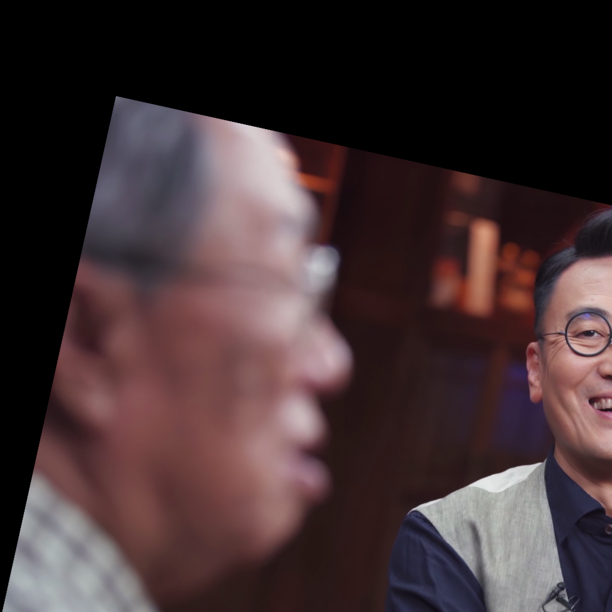

# 课程指南 （持续更新中，请同学们多关注）

## 课程目的及意义
目前换脸算法已经成为人脸编辑/重演领域应用最为广泛的算法，其已经广泛的应用于视频直播、短视频制作、电子商务，甚至电影等场景。换脸算法目前主要有DeepFacelab式、simswap式两种类型的算法路线。Deepfacelab需要针对每一个目标人物训练模型，其特点是效果好，训练代价大。SimSwap不需要针对目标人物训练，它是一种One-shot式的换脸算法，模型一旦训练后可以实现任意人脸不经训练即可实现换脸，其特点是应用方便简单，不依赖特定人物的训练，但其效果相较Deepfacelab逊色。目前，已经发展出大量后续的框架以取代前面两者，例如：应用于直播的deepface live，one-shot界面友好的roop/ROPE/facefusion等。这些算法，他们具有相同的通病，只能处理低清的图片（也即224*224/256/112），光影效果差，需要依赖人脸超分来提示质量，即使通过超分提升分辨率，其人脸质量、光影等等属性与电影级别的应用场景仍有不小的差距。


### SimSwap++(TPAMI)的效果
[Source ID: Scarlett Johansson Target ID: Iron Man (1080p on YouTube)](https://youtu.be/zMpejDaYFHg)

[](https://youtu.be/zMpejDaYFHg)

## 项目内容
本项目致力于提升换脸模型的生成质量，瞄准其最核心的问题：缺乏大规模的电影场景高分辨率人脸数据集。
具体而言，本项目分为三个步骤：
- 第一步下载数据[数据列表](./video_list.md)，需要说明的是每组数据大体数据量相当；
- 第二步，利用本项目中提供的[face_crop_video.py](../face_crop_video.py)来实现从电影数据中粗截取人脸，其使用说明参考[README.md](../README.md)，同学们需要首先参照```Dependencies```安装环境依赖。注意每一部电影需要为其建立一个独立的文件夹以免后续结果覆盖。通过这个脚本得到的数据经常有数据冗余的问题请调整GUI界面中的```Frame Interval```，它用来抽样视频中的帧，取的数值也即多少帧抽样一次。人脸也有可能比较模糊，同学们可以通过调整```Blurry Thredhold```的数值来调整软件筛选人脸清晰度的数值，这个数值越大人脸需要越清晰，也意味着软件会抛弃掉更多的人脸，建议这个数值设置在20~30。人脸分辨率统一规定为```1024*1024```，文件格式统一为```.png```，对齐方式统一为```FFHQ```；
- 第三步，利用本项目中提供的[face_cluster.py](../face_cluster.py)来实现对第二步得到的人脸按其身份进行粗分类，我们最终目标的数据是以人物身份作为文件夹归档，不同的人必须位于不同的文件夹中。这一步需要调整GUI中的聚类中心的数目，需要我们事先大概估计目标文件夹中的人物数量，然后聚类中心取为预估数量的两倍，这样以来GUI可以把不能良好识别的人脸从正常人脸中剥离，注意这一部分软件只能起到粗分类的作用，通过加大聚类中心的数目可以缓解软件将不同的人物分类到同一个文件夹的问题。得到粗分类结果后，我们对这些数据进行手工清洗，去掉人脸朝向角度过大的数据、去掉过于模糊的数据、去掉五官不全的数据、去掉没有被良好对齐的数据。

- ***数据上传***：数据统一保存在***交大云盘***中，请将数据上传至与自己组别一致的文件夹中，请将文件压缩为```.zip```上传，请注意上传的为***清洗后的数据***，链接：[交大云盘](https://jbox.sjtu.edu.cn/l/31pA46)

[](https://jbox.sjtu.edu.cn/l/31pA46)

## 标准人脸样例：


如上图所示，作图为原图，face alignment的工作内容是检测出人脸关键点，然后计算出眼睛的中心点，并取出鼻尖与嘴角，以他们为参考对人脸图像进行截取，为了得到标准化的人脸，通常以眼睛中心的连线向量与标准眼睛连线向量为参考计算两者的仿射变换矩阵对得到的人脸区域做仿射变换，以求得到五点在标准位置附近的人脸。左右眼中心，鼻尖，两嘴角位于图像中相近的区域即可认定为标准人脸，并且注意以这五点区域向外延拓的区域也应与上图类似。
- ***人脸对齐失败***：另外可接受的图片可以以两眼关键点的连线为参考，如若连线显著性倾斜，例如：水平轴与两眼中心点连线超过+/-30度以上即可认定为显著性倾斜，即可抛弃。
- ***人脸放缩失败***：人脸过小，例如：人脸只占图像40%面积以下即可认定为过小，即可抛弃。
- ***大幅度侧脸***：完全侧脸，人脸朝向与镜头呈90度，只要不违背上述两条即可留下。完全背过


## 正常图片样例：
<table frame=void>
	<tr>		  
    <td><center></center></td>
    <td><center></center></td>
    <td><center></center></td>
    </tr>
    <tr>
    <td><center></center></td>
    <td><center></center></td>
    <td><center></center></td>
    </tr>
    <tr>
    <td><center></center></td>
    <td><center></center></td>
    <td><center></center></td>
    </tr>
    
</table>


## 需要被丢弃的图片样例：

### 图像模糊，包括运动失焦、失焦：
<table frame=void>
	<tr>		  
    <td><center></center></td>
    <td><center></center></td>
    <td><center></center></td>
    </tr>
    <tr>		  
    <td><center></center></td>
    <td><center></center></td>
    <td><center></center></td>
    </tr>
</table>

### 五官不全，无法辨认主体身份：

<table frame=void>
	<tr>		  
    <td><center></center></td>
    <td><center></center></td>
    <td><center></center></td>
    </tr>
    <tr>		  
    <td><center></center></td>
    <td><center></center></td>
    <td><center></center></td>
    </tr>
</table>

### 对齐失败：

<table frame=void>
	<tr>		  
    <td><center></center></td>
    <td><center></center></td>
    <td><center></center></td>
    </tr>
</table>

其工作流可以总结如下图：


## SimSwap换脸模型训练 [20231108 Updated!!]
相关训练教程请参考[SimSwap教程主页](https://github.com/neuralchen/SimSwap)

其训练平台有两种：Colab [ <a href="https://colab.research.google.com/github/neuralchen/SimSwap/blob/main/train.ipynb"></a>](https://colab.research.google.com/github/neuralchen/SimSwap/blob/main/train.ipynb)与在本地服务器上训练。Colab是一种开源免费的平台，它能免费获取一般性能的GPU，缺点是每次推出后其相关的节点资源将全部释放，当使用者较多时往往无法获取到可用的计算资源，因此推荐条件特别艰苦，完全无法获得可用的GPU计算资源的同学使用，不建议有可用的计算资源同学使用。本地运行的难点是配置环境，强烈建议同学们使用[Miniconda](https://docs.conda.io/projects/miniconda/en/latest/miniconda-install.html)。
注意本部分完成后需要撰写相关报告，具体要求参考[课程PPT (3.7M)](https://pan.baidu.com/s/1m56mcD_e7_kJvKUZQ45pCQ?pwd=sjtu)。

### 训练数据集
考虑到数据质量及规模问题，本次课程加入VGGFace2数据集作为训练的基础数据，额外加入本次由同学们共同采集的数据作为补充数据。

VGGFace下载链接：

[[谷歌云盘] VGGFace2-224 (10.8G)](https://drive.google.com/file/d/19pWvdEHS-CEG6tW3PdxdtZ5QEymVjImc/view?usp=sharing) [[百度网盘]](https://pan.baidu.com/s/1OiwLJHVBSYB4AY2vEcfN0A) [Password: lrod]

课程采集数据部分下载链接：

[[百度网盘] SJTU_Swap_224.zip (696M)](https://pan.baidu.com/s/1vK-cSTOdaX-UGzKCgJH5SA?pwd=sjtu)

两个数据下载后将他们合并，也即将VGGFace2目录下的所有子文件夹与课程采集数据目录下的所有子文件夹合并在同一个目录下，将合并后的数据集作为训练数据集。


### 测试数据

测试数据包括非对齐人脸图片共计40张，人脸图片需做人脸对齐。

[[图像测试数据.zip(6.7M)]](https://jbox.sjtu.edu.cn/l/o16DNw)

#### 图片测试方式：
将图像测试数据集中的图片```source_[num]```来替换图片```target_[num]```，实例：用```source_01```替换```target_01```，计算替换后的结果图片与```source_[num]```的ArcFace特征的余弦距离。
然后，将```source_[num]```与```target_[num]```交换，以```target_[num]```来替换```source_[num]```，并计算替换后的结果图片与```target_[num]```的ArcFace特征的余弦距离
最后，计算上述两种情况中所有图片的平均余弦距离。注意距离计算不需要将结果图像拼接回原图像。

### ArcFace余弦距离计算伪代码：

```
import torch
import torch.nn.functional as F

imagenet_std = torch.tensor([0.229, 0.224, 0.225]).view(3,1,1)
imagenet_mean= torch.tensor([0.485, 0.456, 0.406]).view(3,1,1)

ArcFace    = torch.load(path_to_arcface_ckpt, map_location=torch.device("cpu"))
ArcFace.eval()
ArcFace.requires_grad_(False)

source_img   = (source_img - imagenet_mean)/imagenet_std                 # source_img~[0,1]
source_img   = F.interpolate(source_img, size=(112,112), mode='bicubic')
source_id    = ArcFace(source_img)                                       # ArcFace model
source_id    = F.normalize(source_id, p=2, dim=1)

result_img   = (result_img - imagenet_mean)/imagenet_std                 # result_img~[0,1]
result_img   = F.interpolate(result_img, size=(112,112), mode='bicubic')
result_id    = ArcFace(result_img)
result_id    = F.normalize(result_id, p=2, dim=1)

cos_dis      = 1 -  cos_loss(source_id, result_id)                       # cosine distance between source image and result image
```

***测试脚本需要同学们参考上述伪代码及simswap项目来完成！***

***不同小组请勿共享生成结果，最终评分过程将会检测文件来源。请勿提交simswap开源模型结果。这些行为将会被视作作弊。***


### 大作业提交链接及DDL

***DDL:  2024.01.14晚上24点前***

***作业提交文件命名规范，```[组名]_final.zip```, 示例：group03_final.zip***

[[大作业提交链接]](https://jbox.sjtu.edu.cn/l/W1renM)

### 相关信息

任何问题请邮件：[xuanhong chen](mailto:chenxuanhongzju@outlook.com)

对研究项目感兴趣的同学也可以邮件咨询，欢迎对于***虚拟人***、***电影换脸***、***人脸重建***、***AIGC***感兴趣的同学前来咨询。

## 相关链接：
- https://github.com/neuralchen/SimSwap
- https://github.com/neuralchen/SimSwapPlus
- (***AIGC入门教程，强烈建议***) https://github.com/neuralchen/NeuralRenderingTutorial
